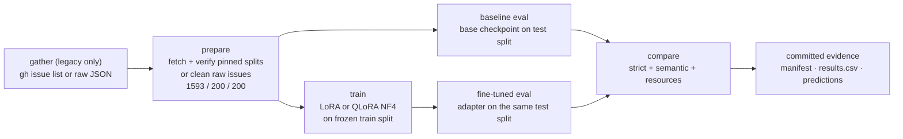

# GitHub Issue Triage: SLM Fine-Tuning Benchmark

Ten small language models are fine-tuned for one narrow task: classify a real `microsoft/vscode` issue as `bug` or `feature-request`. Each tuned model is compared against its own base checkpoint on the same frozen 200-row test set.

[Results](#results) · [Quickstart](#quickstart) · [How it works](#how-it-works) · [Methodology](#methodology) · [Reproduction](#reproduction)


-6e7781?style=flat-square)


## TL;DR

- 10 configurations over two tracks: 6 BF16 LoRA (0.8B–4B nominal) and 4 QLoRA NF4 (8B–14B nominal).
- 9 of 10 configurations improved strict accuracy; 10 of 10 improved semantic accuracy.
- Largest gain: Qwen3-1.7B, 58.0% → 89.0% strict (+31.0 pp).
- Only strict regression: Qwen3.5-4B, 88.5% → 85.0% (-3.5 pp), semantic +1.0 pp.
- Every run trained and evaluated on one RTX 5060 Ti (15.456 GiB torch-visible).


BF16 LoRA and QLoRA NF4 are separate tracks, not a controlled cross-track ranking.

## Quickstart

```bash
git clone https://github.com/RayhanHaqi/github-triage-slm-benchmark.git
cd github-triage-slm-benchmark
python -m pip install -e .
specialist --help
specialist prepare configs/vscode-bug-feature.yaml
python -m unittest discover -s tests -v
```

`prepare` for the bundled config downloads only `train.jsonl`, `validation.jsonl` and `test.jsonl` from the pinned public dataset ([`Tilakoid/vscode-bug-feature-triage`](https://huggingface.co/datasets/Tilakoid/vscode-bug-feature-triage) at revision `15c7d77e083d0cd30ae84cc5de6add1dce6cf950`) into `data/`, verifies exact SHA-256, byte size and row count for every split before use, and maps the remote `validation.jsonl` to local `val.jsonl`. A verified local split is reused without network access. The base install has no GPU dependencies; preparation, `gather` for legacy configs and the CPU-only tests run without the ML stack. Reproducing the published numbers additionally needs the pinned `.[ml]` environment and base weights: [docs/reproduction.md](docs/reproduction.md).

## Why this exists

General-purpose models already read an issue title and body well enough to make a reasonable call. A classifier that only has to route `bug` versus `feature-request` does not obviously need a large checkpoint, so the useful measurement is how much one task-specific tuning pass changes behavior when the evaluation is held fixed.

This benchmark makes that measurement in one narrow setting. Every checkpoint is scored before and after LoRA or QLoRA tuning with the same prompt, decoding settings and test split, so the numbers describe base versus tuned for the same model, not one model against another.

## Results

Strict accuracy on the frozen 200-row test split; deltas are adapter minus base in percentage points. Exact metric definitions are in [Evaluation](#evaluation).

### BF16 LoRA

Run `20260915T112519Z`: full BF16 base weights, adapter from the final epoch (3).

| Model | Base strict | Fine-tuned strict | Gain |
|---|---|---|---|
| Qwen3.5-0.8B | 78.0% | 80.5% | +2.5 |
| LFM2.5-1.2B-Instruct | 62.5% | 90.0% | +27.5 |
| Qwen3-1.7B | 58.0% | 89.0% | +31.0 |
| Qwen3.5-2B | 84.0% | 89.0% | +5.0 |
| Ministral-3-3B-Instruct-2512-BF16 | 61.0% | 87.5% | +26.5 |
| Qwen3.5-4B | 88.5% | 85.0% | -3.5 |

<details>
<summary>BF16 resource and provenance details</summary>

Semantic deltas in table order: +12.5, +25.5, +31.0, +5.0, +26.5, +1.0 pp. Fine-tuned evaluation peak reserved VRAM: 1.96–9.36 GiB; output throughput: 14.85–52.75 tok/s. Training metrics for Qwen3.5-2B cover the resumed segment (steps 400–600) only; Qwen3.5-4B covers the final successful attempt, with two excluded epoch-evaluation OOM attempts. Frozen-vision behavior is not established for this track: configs record `finetune_vision_layers: false` but also `all-linear` targeting, and no artifact lists adapted parameter names. Full per-model table: [run report](benchmarks/20260915T112519Z/report.md).

</details>

### QLoRA NF4

Run `20260916T185922Z`: 4-bit NF4 base weights (double-quantized, bf16 compute, no offload), best validation-loss checkpoint (epoch 2).

| Model | Base strict | Fine-tuned strict | Gain |
|---|---|---|---|
| Qwen3-8B | 87.0% | 89.0% | +2.0 |
| Ministral-3-8B-Instruct-2512-BF16 | 81.5% | 87.5% | +6.0 |
| Qwen3.5-9B | 86.0% | 89.0% | +3.0 |
| Ministral-3-14B-Instruct-2512-BF16 | 85.5% | 88.5% | +3.0 |

<details>
<summary>QLoRA resource and provenance details</summary>

Semantic deltas in table order: +2.0, +7.0, +3.0, +3.0 pp. Fine-tuned evaluation peak reserved VRAM: 6.69–9.90 GiB; output throughput: 5.47–9.45 tok/s. Qwen3-8B was imported byte-identical from earlier run `20260916T120019Z` and measured without GPU sharing. Models 2–4 ran under the one-time approved RustDesk shared-GPU policy (512 MiB aggregate allowance, phase-boundary samples, every accepted peak more than 1 GiB below its retained budget). Full provenance: [run report](benchmarks/qlora-large/20260916T185922Z/report.md).

</details>

## How it works



Every configuration is evaluated on the same frozen 200-row test split, pinned by SHA-256 and re-checked by the comparison step (`test_sha256.match`). Each adapter is scored against its own base checkpoint with identical prompts and greedy decoding. Run metadata, comparisons and per-issue predictions are committed; base weights, adapters and datasets are not.

## Methodology

### Dataset

`microsoft/vscode` issues labeled `bug` or `feature-request`. Temporal per-class split by `created_at`, seed 42, 80/10/10 → **1593 train / 200 val / 200 test**; the test set is balanced 100 `bug` / 100 `feature-request`. The test split SHA-256 (`9fc58e7070c327adaa7b522cf1cd530b90c077dbd54513d00ea31dead5712025`) is recorded in every `comparison.json` and matches across all 20 evaluations. Prepared splits are not committed: the active path fetches them from the pinned public dataset and verifies size, row count and SHA-256 before use. Raw collection snapshots are not published, so a raw `gather` of live issues is a new dataset, not reproduction. Details: [docs/reproduction.md](docs/reproduction.md).

### Fine-tuning

LoRA r=16, alpha=32, dropout 0, 3 epochs, lr 2e-4 cosine, warmup 0.05, weight decay 0.01, `adamw_8bit`, effective batch 8, seed 42, `max_seq_length` 2048. The BF16 track trains a full BF16 base with no quantization. The QLoRA track quantizes the official BF16 checkpoint on the fly to NF4 (double-quantized, bf16 compute, no offload) and restores the best validation-loss checkpoint (epoch 2) before evaluation. Nominal sizes such as "0.8B" and "14B" come from official model names, not exact parameter counts.

### Evaluation

One system prompt (`Classify the GitHub issue into exactly one category: bug or feature-request. Return only the category name.`), greedy decoding, `max_new_tokens` 12, issue text capped at 1800 tokens. Strict accuracy requires the stripped, lowercased output to equal one class name exactly; semantic accuracy requires exactly one class parsed by a forgiving word-boundary regex. Deltas are fine-tuned minus base.

### Hardware

One NVIDIA GeForce RTX 5060 Ti (15.456 GiB torch-visible), CUDA 12.8. Pinned environment: Python 3.11.16, PyTorch 2.11.0+cu128, transformers 5.5.0, peft 0.20.0, datasets 4.3.0, trl 0.24.0, unsloth 2026.9.4, bitsandbytes 0.50.2. Fine-tuned evaluation peak reserved VRAM stayed below 10 GiB in both tracks, so all ten configurations fit on this one GPU. Exact checkpoint revisions are tabulated in [docs/github-triage-benchmark.md](docs/github-triage-benchmark.md).

### Limitations

Single run per configuration on a 200-row holdout: deltas are descriptive, with no confidence intervals or significance tests, and BF16 LoRA versus QLoRA NF4 is not a controlled cross-track ranking. All runs are text-only even for vision-capable checkpoints, and the task is two-class routing only, not severity, assignment or multi-label triage.

<details>
<summary>Run provenance, failures and resume caveats</summary>

- QLoRA models 2–4 executed under manifest commit `b0f91ad46f8491bbe6bba9a453c761cb92efb281`. Qwen3-8B was imported byte-identical from earlier run `20260916T120019Z` (original execution commit `385bbb957733e37d31627ff3f67e9931c95e6946`, evidence pinned at `429d5ccd885ec9188e76ae1d2685e210e5b34e7f`); two prediction-CSV digests in the continuation manifest are stale for that import, while the other ten match.
- Models 2–4 shared the GPU under one-time policy `rustdesk_shared_gpu_v1`: only the exact `/usr/share/rustdesk/rustdesk` binary was allowed memory, 512 MiB aggregate, sampled at phase boundaries rather than monitored continuously.
- The QLoRA track records zero vision-like trainable tensors.
- Failed run `20260916T093135Z` is not part of the reported metrics. QLoRA run directories were cleaned after completion, so `--resume` applies only to partial in-progress runs.
- Full details: [BF16 run report](benchmarks/20260915T112519Z/report.md), [QLoRA run report](benchmarks/qlora-large/20260916T185922Z/report.md), [case analysis](docs/github-triage-benchmark.md), [reproduction notes](docs/reproduction.md).

</details>

## Reproduction

The CLI exposes `gather`, `prepare`, `baseline`, `train`, `evaluate` and `run`; the QLoRA track additionally uses the guarded sequential runner [`scripts/run_qlora_large.py`](scripts/run_qlora_large.py):

```bash
specialist prepare configs/vscode-bug-feature.yaml   # CPU-safe: fetch + verify the pinned splits
specialist run configs/qlora-large/03-qwen3.5-9b.yaml
python scripts/run_qlora_large.py --dry-run          # fetch/verify data; validate pinned env, GPU, disk, git state
```

Pinned configs skip raw `gather`, and calling `specialist gather` on them refuses; raw gather and raw preparation remain available only for legacy configs without a `dataset:` block, whose raw snapshots are not published. The pinned splits are public and verifiable from a standalone clone, but reproducing the published numbers still needs the pinned `.[ml]` environment and the configured base model revisions. Committed benchmark and run artifacts are unchanged and may retain old absolute source paths as provenance; runs created before the pinned dataset change require their recorded checkout and original local data, and current strict resume checks intentionally reject their old manifests and config digests. Full instructions, including environment pins, resume handling and artifact cleanup, are in [docs/reproduction.md](docs/reproduction.md).

## Evidence

- BF16 LoRA run `20260915T112519Z`: [report](benchmarks/20260915T112519Z/report.md) | [results.csv](benchmarks/20260915T112519Z/results.csv) | [manifest.json](benchmarks/20260915T112519Z/manifest.json)
- QLoRA NF4 run `20260916T185922Z`: [report](benchmarks/qlora-large/20260916T185922Z/report.md) | [results.csv](benchmarks/qlora-large/20260916T185922Z/results.csv) | [manifest.json](benchmarks/qlora-large/20260916T185922Z/manifest.json)
- Per-model analysis and representative output cases: [docs/github-triage-benchmark.md](docs/github-triage-benchmark.md)
- Reproduction, operations and artifact policy: [docs/reproduction.md](docs/reproduction.md)

Per-model metrics, `comparison.json` and prediction CSVs live in `models/<slug>/` inside each track directory. Committed: run metadata, metrics, predictions, manifests, reports, `results.csv` and the README chart. Not committed: datasets, base weights, adapters, trainer checkpoints and logs.

## Repository structure

```
assets/                      README chart
benchmarks/                  committed run evidence (BF16 LoRA and QLoRA NF4 tracks)
configs/                     run configurations for both tracks
docs/                        case analysis and reproduction/operations notes
scripts/                     QLoRA sequential runner and README chart generator
src/specialist/              gather, prepare, train, evaluate, CLI, comparison
tests/                       CPU-only regression tests
```

## Related benchmark

[Indonesian HoASA ABSA](https://github.com/RayhanHaqi/hoasa-slm-benchmark), using small models for structured 10-aspect sentiment output.
