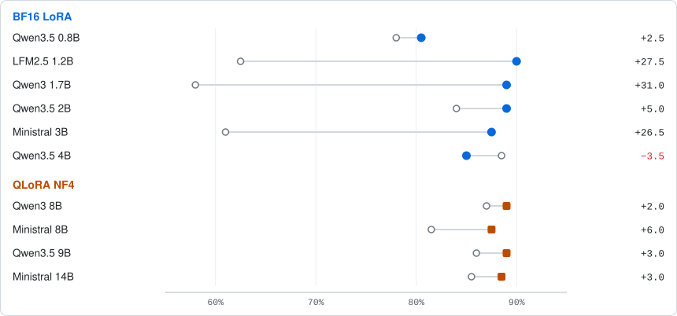
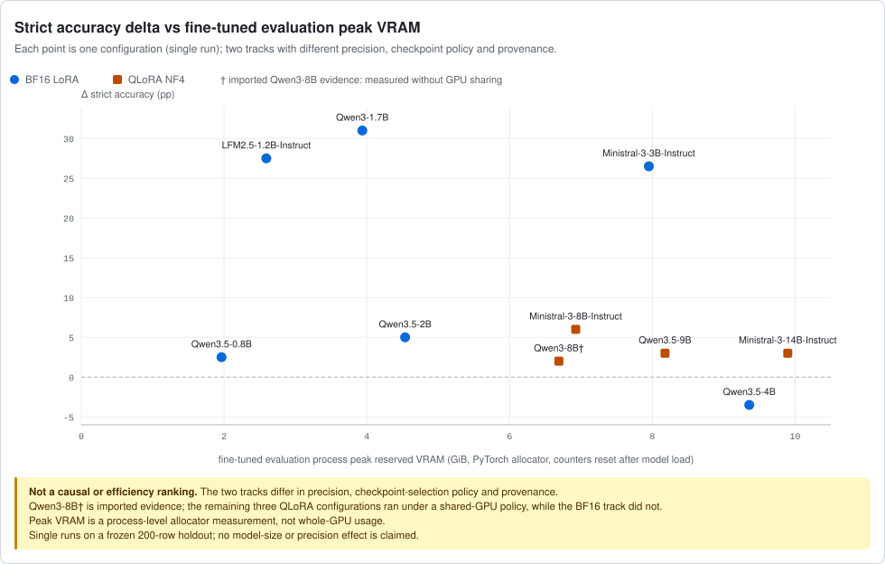
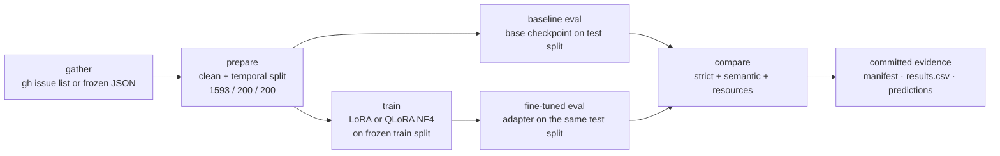

# GitHub Issue Triage — SLM Fine-Tuning Benchmark

Case study: fine-tune several small language models (SLMs) on one narrow GitHub triage task, then compare every fine-tuned adapter against its own base checkpoint on the same frozen test split.

**Research questions**

1. Does fine-tuning improve over the base checkpoint, per model? (base vs fine-tuned, same frozen test split, same evaluator)
2. How do the measured gains relate to nominal parameter count and measured resources (training wall time, peak VRAM)?


-6e7781?style=flat-square)


> [!WARNING]
> **Two tracks, no unified ranking.** The BF16 LoRA and QLoRA NF4 runs differ in precision, checkpoint-selection policy and provenance. Cross-model tradeoffs may be read descriptively, but this is not a controlled cross-track ranking, and no causal model-size or precision effect is claimed. Matched comparisons hold only base vs fine-tuned **within one configuration**.

**Scope.** Two-class classification of a `microsoft/vscode` issue as `bug` or `feature-request` — not a general triage system (no severity, assignment, multi-label routing or needs-info handling) and not a generic framework. All runs are text-only, even for vision-capable checkpoints; no images are used. Internal names are intentionally unchanged: the Python package is `slm-specialist` and the CLI is `specialist`; only the repository identity moved to `github-triage-slm-benchmark`.

## At a glance

| Snapshot | Value |
|---|---|
| Configurations | 10 completed (6 BF16 LoRA + 4 QLoRA NF4) |
| Strict accuracy improved | 9 of 10 configurations (semantic accuracy: 10 of 10) |
| Best strict delta | +31.0 pp — Qwen3-1.7B (0.580 → 0.890) |
| Largest strict regression | -3.5 pp — Qwen3.5-4B (0.885 → 0.850; semantic +1.0 pp) |
| Frozen test split | 200 rows, temporal holdout: 100 `bug` / 100 `feature-request` |
| Hardware | 1× NVIDIA GeForce RTX 5060 Ti, 15.456 GiB torch-visible, CUDA 12.8 |
| Peak reserved VRAM (fine-tuned evaluation) | ≤ 9.36 GiB BF16 LoRA · ≤ 9.94 GiB QLoRA acceptance |

Values are read from the committed `results.csv` files ([BF16](benchmarks/20260915T112519Z/results.csv), [QLoRA](benchmarks/qlora-large/20260916T185922Z/results.csv)); run IDs and links are in [Evidence](#evidence).

## Base → fine-tuned strict accuracy



Each row is one configuration on the frozen 200-row test split; deltas are adapter minus base in percentage points. The figure is regenerated deterministically from the committed `results.csv` bytes by [`scripts/generate_readme_charts.py`](scripts/generate_readme_charts.py) (`python scripts/generate_readme_charts.py --check`).

## Key findings

- **Semantic behavior.** Strict accuracy improved in 9 of 10 configurations; semantic accuracy improved in 10 of 10. The single strict regression still parsed as one class: fine-tuned Qwen3.5-4B produced classifiable output more often than base (semantic +1.0 pp) but less often matched an exact bare label.
- **Largest gain.** Qwen3-1.7B: 0.580 → 0.890 strict (+31.0 pp; semantic likewise +31.0 pp) — the largest delta in the study, and it started from the lowest base strict accuracy (0.580).
- **Notable regression.** Qwen3.5-4B: 0.885 → 0.850 strict (-3.5 pp) — the strongest base strict score in the BF16 track; semantic +1.0 pp.
- **Not monotonic in nominal size.** Gains do not order by nominal parameter count: the largest deltas come from 1.2B–3B configurations (+26.5 to +31.0 pp strict), while the smallest include a 0.8B configuration (+2.5 pp) and every 8B–14B configuration (+2.0 to +6.0 pp). No "bigger is better" claim is made.
- **Resources.** All 10 configurations trained and evaluated on one RTX 5060 Ti; the longest single training phase was 6577 s (Ministral-3-14B). Fine-tuned evaluation peak reserved VRAM was ≤ 9.36 GiB in the BF16 track and ≤ 9.94 GiB across QLoRA acceptance runs. The remaining three QLoRA configurations ran under the documented shared-GPU (RustDesk) policy; the BF16 track and the imported Qwen3-8B evidence had no GPU sharing, so resource numbers are descriptive within each track, not a controlled efficiency ranking.
- **Single-run frozen holdout.** Every delta is a single-run descriptive difference on a 200-row holdout; there are no confidence intervals or significance tests, and no general-quality claim.

## Strict delta vs evaluation peak VRAM



Strict delta (adapter minus base, pp) against the fine-tuned evaluation process peak reserved by the PyTorch allocator (GiB; counters reset after model load). Each point is one configuration, one single run; BF16 LoRA and QLoRA NF4 are separate tracks with different precision, checkpoint-selection policy and provenance (Qwen3-8B† is imported evidence; the remaining three QLoRA configurations ran under a shared-GPU policy). The figure is **descriptive and non-causal** — it is not an efficiency or size ranking.

## Pipeline



The `specialist` CLI runs each phase in a fresh process; the QLoRA track uses the guarded sequential runner [`scripts/run_qlora_large.py`](scripts/run_qlora_large.py). Commands: [docs/reproduction.md](docs/reproduction.md).

## Results by track (exact values)

Strict accuracy on the frozen 200-row test split; single runs, deltas are adapter minus base in percentage points. Metric definitions are in [Methodology and dataset](#methodology-and-dataset).

### BF16 LoRA — run `20260915T112519Z`

6 configurations, roughly 0.8B–4B nominal; full BF16 base weights + LoRA, adapter = final epoch (3); `LATEST` pointer → `20260915T112519Z`.

| Configuration | Strict base → FT | Δ strict | Δ semantic | FT peak reserved VRAM (GiB) | FT output speed (tok/s) |
|---|---|---|---|---|---|
| Qwen3.5-0.8B | 0.780 → 0.805 | +2.5 | +12.5 | 1.96 | 27.12 |
| LFM2.5-1.2B-Instruct | 0.625 → 0.900 | +27.5 | +25.5 | 2.59 | 52.75 |
| Qwen3-1.7B | 0.580 → 0.890 | +31.0 | +31.0 | 3.94 | 26.96 |
| Qwen3.5-2B | 0.840 → 0.890 | +5.0 | +5.0 | 4.54 | 22.99 |
| Ministral-3-3B-Instruct | 0.610 → 0.875 | +26.5 | +26.5 | 7.95 | 18.88 |
| Qwen3.5-4B | 0.885 → 0.850 | -3.5 | +1.0 | 9.36 | 14.85 |

<details>
<summary>BF16 vision-freeze behavior is <strong>not established</strong> (historical run)</summary>

The BF16 configs record `finetune_vision_layers: false` but also Unsloth `all-linear` targeting, and no BF16 artifact lists adapted parameter names — Unsloth's `all-linear` handling may have silently overridden the recorded freeze flags. Frozen-vision behavior for this historical track is therefore unknown and is not validated by, or rewritten from, the QLoRA run's evidence. Only the QLoRA track records trainable-parameter evidence (zero vision-like tensors; see its run report).

</details>

### QLoRA NF4 — run `20260916T185922Z`

4 configurations, roughly 8B–14B nominal; 4-bit NF4 base (double-quantized, bf16 compute, no offload) + LoRA, best validation-loss checkpoint (epoch 2) restored before fine-tuned evaluation; `LATEST` pointer → `20260916T185922Z`.

| Configuration | Strict base → FT | Δ strict | Δ semantic | FT peak reserved VRAM (GiB) | FT output speed (tok/s) |
|---|---|---|---|---|---|
| Qwen3-8B (imported†) | 0.870 → 0.890 | +2.0 | +2.0 | 6.69 | 8.18 |
| Ministral-3-8B-Instruct | 0.815 → 0.875 | +6.0 | +7.0 | 6.93 | 8.20 |
| Qwen3.5-9B | 0.860 → 0.890 | +3.0 | +3.0 | 8.18 | 9.45 |
| Ministral-3-14B-Instruct | 0.855 → 0.885 | +3.0 | +3.0 | 9.90 | 5.47 |

<details>
<summary>† Imported Qwen3-8B provenance (not rerun)</summary>

Qwen3-8B was **imported byte-identical** from earlier run `20260916T120019Z` (original execution commit `385bbb957733e37d31627ff3f67e9931c95e6946`; evidence pinned at `429d5ccd885ec9188e76ae1d2685e210e5b34e7f`). Its recorded phases ran 2026-09-16T12:00:19Z–13:01:22Z and are excluded from run `20260916T185922Z`'s interval. The committed source and imported files match byte-for-byte; however, two prediction-CSV SHA-256 values stored in the continuation manifest are stale and do not match either copy (the other 10 recorded digests match). Models 2–4 executed in `20260916T185922Z` under manifest commit `b0f91ad46f8491bbe6bba9a453c761cb92efb281`. The imported evidence was measured **without** GPU sharing.

</details>

<details>
<summary>Shared-GPU (RustDesk) conditions for QLoRA models 2–4</summary>

One-time user-approved policy `rustdesk_shared_gpu_v1`: only the exact `/usr/share/rustdesk/rustdesk` executable was allowed GPU memory, 512 MiB aggregate allowance, observed via **phase-boundary** samples (13 retained per model), not continuous monitoring — no instantaneous safety guarantee is claimed. Retained minimum effective capacity: 12.243 / 12.445 / 12.473 GiB; the only nonzero observed RustDesk usage was 257 MiB on Ministral-3-8B (0 MiB elsewhere). Every accepted reserved peak stayed more than 1 GiB below its retained budget. Qwen3-8B ran without GPU sharing, so its timing/VRAM is not directly comparable to models 2–4.

</details>

**Metric notes.** *Strict accuracy*: the stripped, lowercased output must exactly equal one class name. *Semantic accuracy*: exactly one class parsed from the raw output by a forgiving word-boundary regex; both/neither counts as invalid and wrong. *FT peak reserved VRAM*: adapter-evaluation process peak reserved by the PyTorch allocator (GiB, 1024³; counters reset after model load) — a process-level measurement, not whole-GPU usage. *FT output speed*: stored generated tokens divided by total `model.generate` elapsed, so it includes prefill and is not pure decode throughput. *Strict/semantic deltas*: fine-tuned minus base.

## Methodology and dataset

**Dataset (frozen).** Source: `microsoft/vscode` issues, classes `bug` and `feature-request`. Split: temporal per-class by `created_at`, seed 42, 80/10/10 → **1593 train / 200 val / 200 test**; the test set is balanced 100 `bug` + 100 `feature-request`. Split SHA-256 pins: train `3d58b700bb165187462986d719edc6b705e612af9aba2bd23ea1e1410f26202b`, val `7423f47f80368404aa0d21e9bb9c19719b624a67519146c8c9d720f42e517348`, test `9fc58e7070c327adaa7b522cf1cd530b90c077dbd54513d00ea31dead5712025`. `comparison.json` records `test_sha256.match = true` for every model, so all 20 evaluations share one test set. Raw and prepared data files are intentionally not committed.

**Decoding (common).** One system prompt — *"Classify the GitHub issue into exactly one category: bug or feature-request. Return only the category name."* — with greedy decoding (`do_sample: false`), `max_new_tokens: 12`, issue text truncated at `max_user_tokens: 1800`, `max_seq_length: 2048`, `pad_eos: true`; Qwen-family runs disable thinking (`enable_thinking: false`). Single pass over the 200 issues per evaluation.

**Training recipe (common).** LoRA r=16 / alpha=32 / dropout=0 / bias none, 3 epochs, lr 2e-4 cosine, warmup 0.05, weight decay 0.01, `adamw_8bit`, Unsloth gradient checkpointing, seed 42, `max_seq_length` 2048, effective batch 8. BF16 track: full BF16 base, no quantization, per-device 2 × accumulation 4. QLoRA track: official BF16 checkpoint quantized on the fly to NF4 (double-quantized, bf16 compute, no offload), per-device 2 × accumulation 4 except Ministral-3-14B at 1 × 8. "0.8B" … "14B" are nominal sizes from official model names, not exact parameter counts.

**Environment (pinned).** Python 3.11.16; PyTorch 2.11.0+cu128; transformers 5.5.0; peft 0.20.0; datasets 4.3.0; trl 0.24.0; unsloth 2026.9.4; unsloth_zoo 2026.9.3; bitsandbytes 0.50.2; accelerate 1.15.0; CUDA 12.8; one NVIDIA GeForce RTX 5060 Ti (torch-visible total 15.456 GiB, single GPU). The same metrics JSONs also record the exact checkpoint revisions; pins are tabulated in [docs/github-triage-benchmark.md](docs/github-triage-benchmark.md).

**Evaluator checks.** Both metric JSONs carry the `test_sha256` computed from the exact split bytes; `comparison.json` fails loudly if baseline and fine-tuned hashes differ, if base model identity/revision differs, or if effective quantization settings differ. Failed/interrupted attempts are excluded from the reported successful-run metrics, and the training-metric scope is recorded per row.

## Reproduction

```bash
git clone https://github.com/RayhanHaqi/github-triage-slm-benchmark.git
cd github-triage-slm-benchmark
python -m pip install -e .                 # CLI + PyYAML only; gather/prepare/--help work with this
specialist --help
python -m unittest discover -s tests -v    # no GPU, no network
```

The ML phases (baseline/train/evaluate) need the pinned `.[ml]` extra and the frozen experiment environment; see [docs/reproduction.md](docs/reproduction.md).

> [!IMPORTANT]
> **A standalone clone cannot reproduce the frozen results.** Datasets and model weights are not committed. Exact reproduction requires the sibling `/home/tilakoid/github-triage-data` files matching the recorded SHA-256 hashes; the QLoRA runner pins that machine-specific path. A live `gh issue list` gather produces a **new** dataset, not the frozen one.

<details>
<summary>Exact reproduction constraints and run-resume caveats</summary>

- The QLoRA runner's `--dry-run` is not CPU-only: it validates the pinned environment versions, torch-visible GPU identity, ≥ 80 GiB free disk, frozen data hashes and a clean git tree/HEAD, without downloading models or running a phase. A new run additionally requires no tracked changes and no untracked paths.
- Resuming a finished committed run is not a quickstart: `benchmarks/qlora-large/20260916T185922Z` was cleaned up after completion (adapters, trainer checkpoints and scratch caches deleted; `cleanup.json` records the bytes). `--resume` is for a partial, in-progress run on the same machine.
- BF16 Qwen3.5-2B training metrics cover the resumed segment (steps 400–600) only; BF16 Qwen3.5-4B values cover the final successful attempt (two epoch-evaluation OOM attempts excluded); QLoRA Qwen3-8B training rows are the imported source-run metrics.
- The full instruction set, including the guarded QLoRA runner operations, is in [docs/reproduction.md](docs/reproduction.md).

</details>

## Evidence

- Main case analysis: [docs/github-triage-benchmark.md](docs/github-triage-benchmark.md) (per-model analysis; separate document).
- BF16 track run `20260915T112519Z`: [report](benchmarks/20260915T112519Z/report.md) | [results.csv](benchmarks/20260915T112519Z/results.csv) | [manifest.json](benchmarks/20260915T112519Z/manifest.json)
- QLoRA track run `20260916T185922Z`: [report](benchmarks/qlora-large/20260916T185922Z/report.md) | [results.csv](benchmarks/qlora-large/20260916T185922Z/results.csv) | [manifest.json](benchmarks/qlora-large/20260916T185922Z/manifest.json)
- Earlier committed QLoRA attempts: failed run [`20260916T093135Z`](benchmarks/qlora-large/20260916T093135Z/) and partial source run [`20260916T120019Z`](benchmarks/qlora-large/20260916T120019Z/) used for the imported Qwen3-8B evidence.
- Reference single-config run: [runs/20260915T093353Z/](runs/20260915T093353Z/) (original reference metadata, metrics, predictions).
- Historical BF16 path `benchmarks/20260915T100825Z` is an uncommitted aborted attempt and is not part of the benchmark evidence.

Per-model metrics, comparisons, prediction CSVs and run info live under `models/` in each track directory (`benchmarks/20260915T112519Z/models/<slug>/`, `benchmarks/qlora-large/20260916T185922Z/models/<slug>/workspace/`).

Charts: [`assets/strict-accuracy-dumbbell.svg`](assets/strict-accuracy-dumbbell.svg) and [`assets/strict-delta-vs-vram.svg`](assets/strict-delta-vs-vram.svg), regenerated from the committed CSVs by [`scripts/generate_readme_charts.py`](scripts/generate_readme_charts.py) (stdlib only; `--check` verifies the committed SVGs are byte-identical to a fresh render).

## Artifact policy (git)

Committed: source, configs, tests, run metadata (`config.yaml`, `dataset_stats.json`, `run_info.json`, `*_metrics.json`, `comparison.json`), prediction CSVs, benchmark `manifest.json` / `report.md` / `results.csv`, and the README SVGs.

Not committed: dataset copies, model weights and adapters, trainer checkpoints, caches, and process logs/transcripts.

<details>
<summary>Artifact retention details</summary>

Retained manifests, metrics and predictions are committed; diagnostic logs remain local and ignored. Adapters, trainer checkpoints, copied split files and scratch caches were deleted at cleanup per policy (per-model `cleanup.json` records targets and bytes), and `workspace/unsloth_compiled_cache/` is retained for the three QLoRA vision models as produced. Only failed bulk-run cache and model weights were deleted locally with user approval — no blanket removal of retained artifacts. Full policy: [docs/reproduction.md](docs/reproduction.md).

</details>

## Repository map

```
configs/                     BF16 reference config + configs/qlora-large/*.yaml (4 fixed models)
src/specialist/              gather, prepare, model loading, train, evaluate, CLI, comparison
scripts/run_qlora_large.py   guarded sequential runner for the 4-model QLoRA track
scripts/generate_readme_charts.py  README SVG generator (stdlib only, reads committed CSVs)
benchmarks/                  committed completed, partial and failed run evidence by track
runs/                        reference run directory (metadata/metrics/predictions committed)
assets/                      README charts (regenerated from committed results.csv)
tests/                       cheap regression tests (no GPU, no network)
docs/                        case analysis and reproduction/operations notes
```

## Tests

```bash
python -m unittest discover -s tests -v            # no GPU, no network
python scripts/generate_readme_charts.py --check   # chart data facts + reproducible SVGs
```
